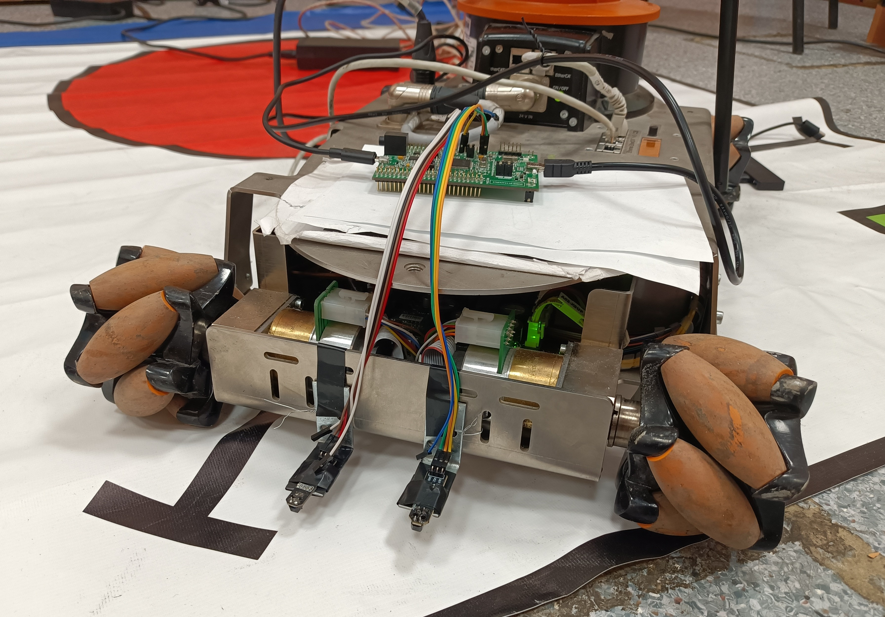

# Детектирование линии с помощью датчиков FC-123

> Данный проект является частью **системы следования робота KUKA youBot по линии**. Основной проект размещен [по ссылке](https://github.com/Ignanastya/line_sens.git).

### Используемое оборудовaние:
- отладочная плата STM32F4-Discovery;
- два инфракрасных датчика FC-123.

### Краткое описание системы

Инфракрасные датчики используются для детектирования цвета поверхности. Таким образом, располагая датчики по обе стороны линии, мы имеем возможность отслеживать отклонение робота от нее.

Инфракрасные датчики подключаются к отладочной плате, которая передает считанные значения (0 или 1 для каждого из датчиков) по USB, подключенному к компьютеру. В контексте передачи данных по USB отладочная плата STM32F4-Discovery представляет собой устройство USB CDC.

Ниже представлена система детектирования линии в сборе:

